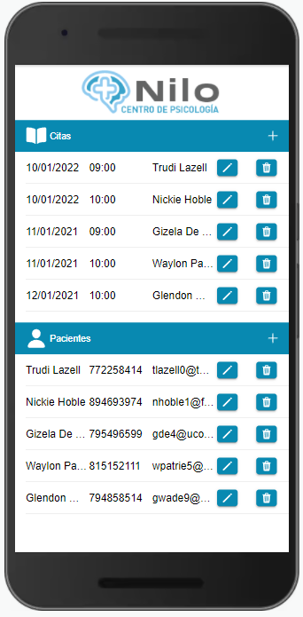
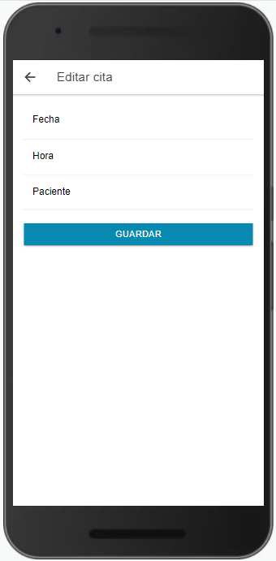
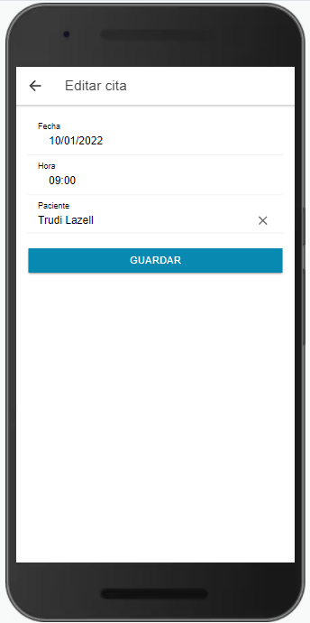
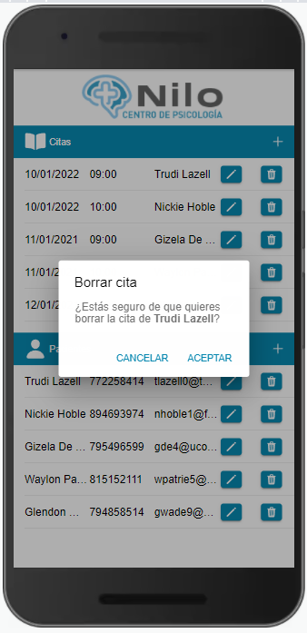
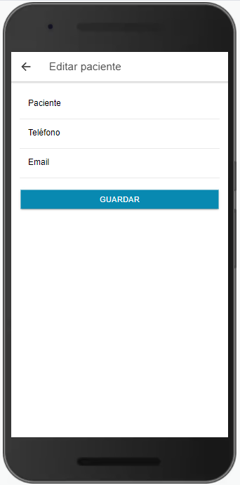
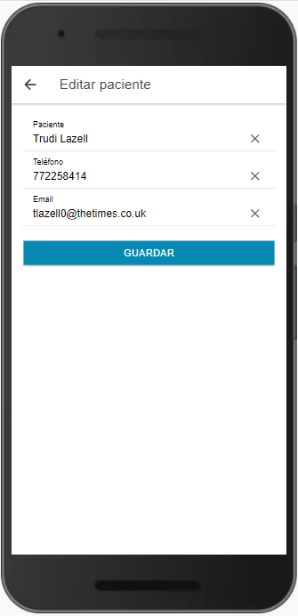
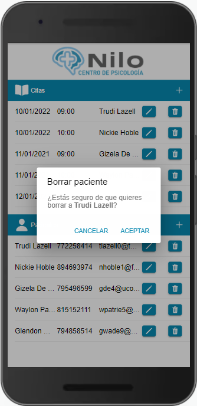

# ClinicaNiloIonicApp


Aplicación desarrollada con Ionic para la primera evaluación de la asignatura de Acceso a Datos del CFGS de Desarrollo de Aplicaciones Multiplataforma (IES Campanillas).

Enlace al vídeo resumen del funcionamiento de la App - [YOUTUBE](https://youtu.be/faZBctWYOQ0)

Para la persistencia de datos se ha utilizado Capacitor, para utilizarlo, tienes que instalarlo con los siguientes comandos:
```consola
npm install @capacitor/storage
npx cap sync
´´´´

### Pantalla principal: 


### Añadir, editar y borrar cita:
  

### Añadir, editar y borrar paciente:
  
